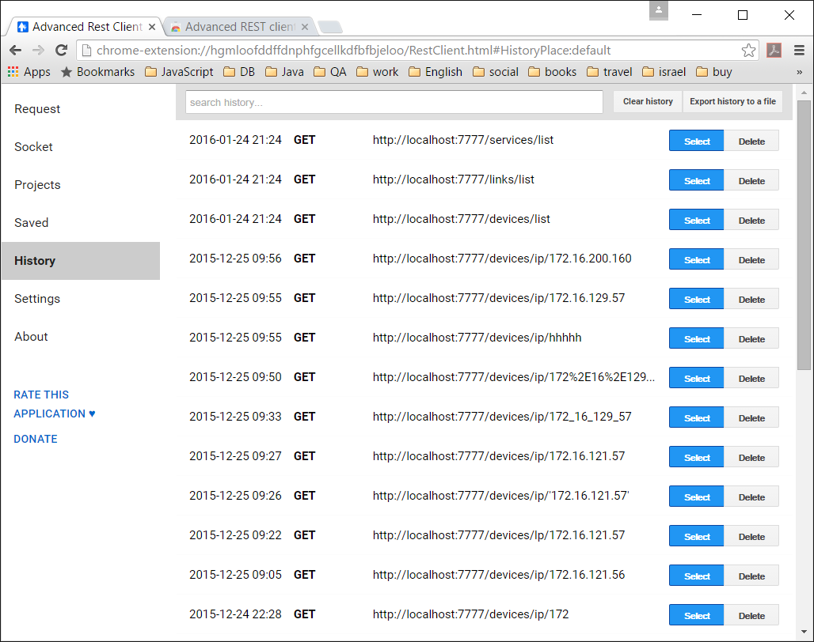

# Atrinet REST Device API

##1. Get list of all devices.
####  PROTOCOL: GET
[http://localhost:7777/devices/list](http://localhost:7777/devices/list)

##2. Get devise by id.
####  PROTOCOL: GET
[http://localhost:7777/devices/id/{device id}](http://localhost:7777/devices/id/100)

```
Example http://localhost:7777/devices/id/100
where 100 is device id.
```

```
 {
    "id": 3,
    "status": "OK",
    "name": "20.25.30.3",
    "ipAdress": "20.25.30.3",
    "location": "F2",
    "serialNumber": "N/A",
    "barCode": "N/A",
    "cleiCode": "N/A",
    "usiCode": "N/A",
    "swVersion": "5.0.4.b",
    "hwVersion": "14.00",
    "type": "A-4100",
    "contact": "efi"
}
```

##3. Get devise by IP Address.
####  PROTOCOL: GET
[http://localhost:7777/devices/ip/{ip address}](http://localhost:7777/devices/ip/10.20.30.48)

```
Example http://localhost:7777/devices/ip/10.20.30.48
where 10.20.30.48 is device ip address.
```

```
 {
    "id": 3,
    "status": "OK",
    "name": "20.25.30.3",
    "ipAdress": "20.25.30.3",
    "location": "F2",
    "serialNumber": "N/A",
    "barCode": "N/A",
    "cleiCode": "N/A",
    "usiCode": "N/A",
    "swVersion": "5.0.4.b",
    "hwVersion": "14.00",
    "type": "A-4100",
    "contact": "efi"
}
```


##4. Get devise by name.
####  PROTOCOL: GET
[http://localhost:7777/devices/name/{device name}](http://localhost:7777/devices/name/as-800)

```
Example http://localhost:7777/devices/name/as-800
where as-800 is device name.
```

```
 {
    "id": 3,
    "status": "OK",
    "name": "20.25.30.3",
    "ipAdress": "20.25.30.3",
    "location": "F2",
    "serialNumber": "N/A",
    "barCode": "N/A",
    "cleiCode": "N/A",
    "usiCode": "N/A",
    "swVersion": "5.0.4.b",
    "hwVersion": "14.00",
    "type": "A-4100",
    "contact": "efi"
}
```

# Atrinet REST Link API

##1. Get list of all links.
####  PROTOCOL: GET
[http://localhost:7777/links/list](http://localhost:7777/links/list)

```
[
   {
      "id": 169
      "name": "10.220.152.90:TenGigE 1/9/1-10.220.152.90:TenGigE 1/19/1"
      "ipAddress": null
      "portId1": 129
      "portId2": 136
      "status": "TOPO_CREATED"
   },
   {
   "id": 169
   "name": "10.220.152.90:TenGigE 1/9/1-10.220.152.90:TenGigE 1/19/1"
   "ipAddress": null
   "portId1": 129
   "portId2": 136
   "status": "TOPO_CREATED"
   }
]
```

##2. Get link by id.
####  PROTOCOL: GET
[http://localhost:7777/links/id/{device id}](http://localhost:7777/links/id/100)

```
Example http://localhost:7777/links/id/169
where 100 is link id.
```

```
 {
    "id": 169
    "name": "10.220.152.90:TenGigE 1/9/1-10.220.152.90:TenGigE 1/19/1"
    "ipAddress": null
    "portId1": 129
    "portId2": 136
    "status": "TOPO_CREATED"
}
```

##3. Get link by IP Address.
####  PROTOCOL: GET
[http://localhost:7777/links/ip/{ip address}](http://localhost:7777/links/ip/10.20.30.48)

```
Example http://localhost:7777/links/ip/10.20.30.48
where 10.20.30.48 is link ip address.
```


##4. Get link by name.
####  PROTOCOL: GET
[http://localhost:7777/links/name/{device name}](http://localhost:7777/links/name/as-800)

```
Example http://localhost:7777/links/name/as-800
where as-800 is link name.
```

# Atrinet REST Service API

##1. Get list of all services.
####  PROTOCOL: GET
[http://localhost:7777/services/list](http://localhost:7777/services/list)

##2. Get services by id.
####  PROTOCOL: GET
[http://localhost:7777/services/id/{services id}](http://localhost:7777/services/id/100)

```
Example http://localhost:7777/services/id/100
where 100 is service id.
```

##3. Get service by external id.
####  PROTOCOL: GET
[http://localhost:7777/services/external/id/{serviceExternalId}](http://localhost:7777/services/external/id/100)

```
Example http://localhost:7777/services/external/id/100
where 100 is service external id.
```


##4. Get service by description.
####  PROTOCOL: GET
[http://localhost:7777/services/description/{description}](http://localhost:7777/services/description/xxx)

```
Example http://localhost:7777/services/description/xxx
where xxx is service description.
```

##5. Get service by order name.
####  PROTOCOL: GET
[http://localhost:7777/services/order/name/{orderName}](http://localhost:7777/services/order/name/xxx)

```
Example http://localhost:7777/services/order/name/xxx
where xxx is service order name.
```

##6. Get service by operator name.
####  PROTOCOL: GET
[http://localhost:7777/services/operator/name/{operatorName}](http://localhost:7777/services/operator/name/xxx)

```
Example http://localhost:7777/services/operator/name/xxx
where xxx is service operator name.
```

# Java Melody Monitoring

[http://localhost:7777/monitoring](http://localhost:7777/monitoring)

# Atrinet REST Monitoring

##1. Gives very reassuring {"status":"UP"} and it's used for health checks
####  PROTOCOL: GET
[http://localhost:7777/health](http://localhost:7777/health)

##2. it's used to read metrics collected by application, and by default returns a list of "system" metrics
####  PROTOCOL: GET
[http://localhost:7777/metrics](http://localhost:7777/metrics)


##1. Get list of all devices.
####  PROTOCOL: GET
[http://localhost:7777/devices/list](http://localhost:7777/devices/list)


## List of useful sites for client development project

* [spring-boot](http://projects.spring.io/spring-boot/)
* [spring-boot reference](http://docs.spring.io/spring-boot/docs/current-SNAPSHOT/reference/htmlsingle/)
* [spring projects](http://spring.io/projects)
* [spring-framework](http://projects.spring.io/spring-framework/)
* [spring scheduling](https://spring.io/guides/gs/scheduling-tasks/)
* [gradle docs](https://docs.gradle.org/current/release-notes)
* [gradle eclipse plugin](https://docs.gradle.org/current/userguide/eclipse_plugin.html)
* [Lombok eclipse plugin](https://projectlombok.org/download.html)

## How to build and run

1. From project dir run command `gradlew build`
2. After build you will get `.\atrinet-rest-server-spring-boot\build\libs\atrinet-rest-server-spring-boot-0.0.1-SNAPSHOT.jar` file.
3. Run jar file with the next command `java -Dartinet.remote.ip=172.16.150.4 -jar atrinet-rest-server-spring-boot-0.0.1-SNAPSHOT.jar` where `-Dartinet.remote.ip=172.16.150.4` is IP of remote server.
4. Before running any REST command from the browser you must login as user: `user` and password: `123456`.
5. It is better to use Chrome plugin [Advanced REST Client](https://chrome.google.com/webstore/detail/advanced-rest-client/hgmloofddffdnphfgcellkdfbfbjeloo?utm_source=chrome-app-launcher-info-dialog) for running REST commands.

Advanced REST Client History example: 




## README format

Markdown is a markup language with plain text formatting syntax designed so that it can be converted 
to HTML and many other formats using a tool by the same name.

[markdown](https://github.com/adam-p/markdown-here/wiki/Markdown-Cheatsheet)
